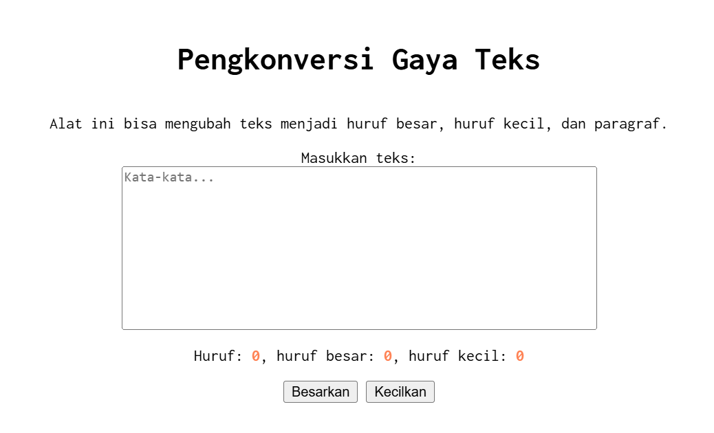

# Tugas Mandiri 03: GUI dengan HTML dan CSS
## Nama : Haryanto Wifakul Azmi Kelas : SE 08 02 Nim : 103122400037
### Soal
Setelah kamu menyelesaikan tugas pendahuluan (bisa buka di atas), terapkanlah fungsi untuk (1) menghitung huruf kecil yang disediakan di #hk, (2) mengubah huruf kecil ke huruf besar ketika pengguna menekan tombol #huruf-besar, dan (3) mengubah huruf besar ke huruf kecil ketika pengguna menekan tombol #huruf-kecil.

Kemudian, hapuslah fitur "Paragrafkan" dari alat.

NOTE: Asprak akan mereplikasi hasil tugas teman-teman apakah sesuai dengan harapan DAN apakah output, kode sumber, dan deskripsi sama sesuai.

### Kode sumber
terdapat di [index.js](index.js) dan [index.html](index.html)

## Output

## Deskripsi

Dikarenakan Waktu TP itu aga ambigu js nya dibenerin atau tidak jadi saya disini hanya tinggal menghapus button paragraf pada [index.html](index.html) dan menghapus fungsi button paragraf pada [index.js](index.js) agar tidak membuat berat sistem yang ada