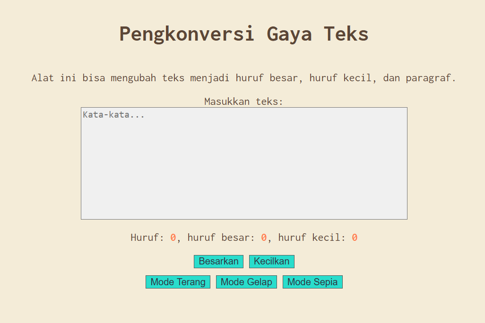

# 04_Automata_dan_Table-Driven Construction
## Nama : Haryanto Wifakul Azmi  
## Kelas : SE 08 02  
## Nim : 103122400037  

---

## Soal

Tambahkan **mode sepia** dengan ketentuan:

| Elemen           | Warna     |
|------------------|----------|
| Latar belakang   | #F4ECD8  |
| Warna teks       | #5B4636  |

Ketentuan tambahan:
1. Form (textarea) tetap berwarna putih.
2. Bagian mode harus memiliki tiga tombol: **light, dark, dan sepia**.
3. Perpindahan state:
   - `light` → `light-mode`
   - `dark` → `dark-mode`
   - `sepia` → `sepia-mode`

---

## Kode Sumber

- HTML: :[index.html](index.html)
- CSS: : [index.css](index.css)
- JavaScript: [index.js](index.js)

---

## Output



---

## Deskripsi

Pada implementasi ini ditambahkan **mode sepia** selain mode terang dan gelap.

### 1. CSS (Sepia Mode)
```css
.sepia-mode {
    background-color: #F4ECD8;
    color: #5B4636;
} 
```
### 2. jS (Sepia Mode)
```
sepiaModeButton.addEventListener("click", () => {
    document.body.classList.add("sepia-mode");
    document.body.classList.remove("dark-mode");
    document.body.classList.remove("light-mode");
});
```
