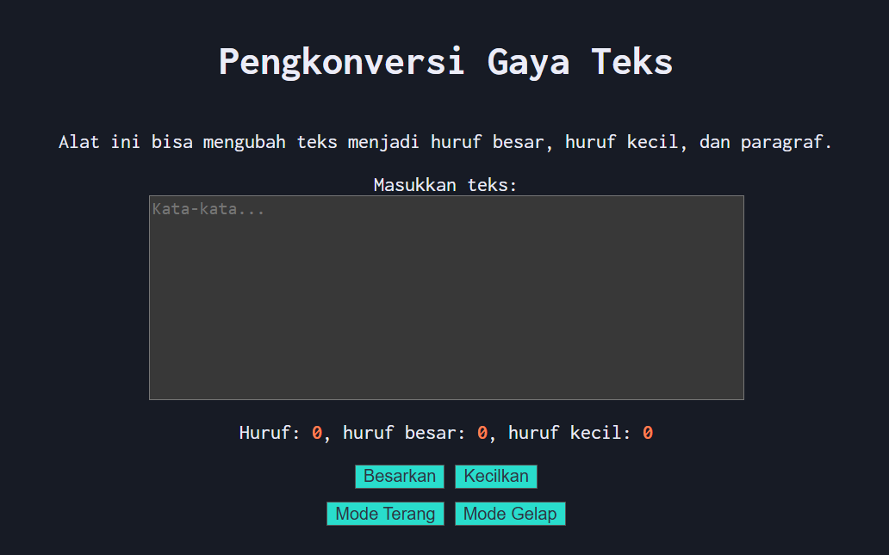

# 04_Automata_dan_Table-Driven Construction
## Nama : Haryanto Wifakul Azmi Kelas : SE 08 02 Nim : 103122400037
### Soal

Tambahkan mode gelap sekaligus untuk editor-kecil dan tombol-tombolnya. Ketentuan warna untuk latar belakang editor-kecil adalah #2e3443, sementara untuk tombol adalah #29ddcc. Teks untuk tombol tetap mengikuti warna teks sebelumnya.Untuk menghapus pinggiran tombol, nyatakan properti border untuk tidak ditunjukkan.

### kode sumber
[index.html](index.html)
[index.css](index.css)
[index.js](index.js)

## Output


## Deskripsi

pada kali ini kita mengubah light mode dan dark mode dengan menambahkan button dan membedakan div agar menjadi di bawah, dengan syntax js ini ```document.body.classList.add("dark-mode"); ``` dan pada css tambahkan 
```
.dark-mode button {
    background-color: #29ddcc;
    color: #2e3443;
    border: 1px solid #555;
}

.dark-mode .kotak-input {
    display: block;
    resize: none;
    background-color: #383838;
    color: #ebecf7;
}
```
untuk mengubah style pada dark mode