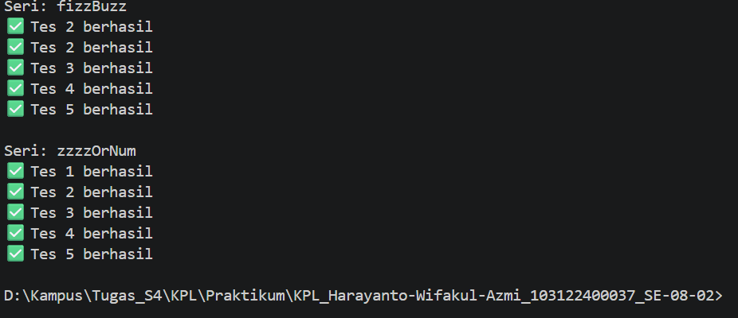

# 05_Generics
## Nama : Haryanto Wifakul Azmi
## Kelas : SE-08-02
## Nim : 103122400037

---

## Soal

Aturan FizzBuzz kali ini adalah:

Fungsi fizzBuzz hanya menerima larik yang semua elemennya terdiri dari bilangan bulat dan mengeluarkan larik pula yang bisa jadi bercampur string dan bilangan
Fungsi zzzzOrNum hanya menerima sebuah data tunggal berupa bilangan bulat dan mengembalikan "Fizz", "FizzBuzz", "Buzz", atau bilanga bulat sesuai logikanya
Kedua fungsi harus ada dan harus disertai JSDoc sesuai tipe data yang disiratkan dari no. 1, no. 2, dan perilaku yang diharapkan di bawah
fizzBuzz harus menggunakan fungsi zzzzOrNum di dalamnya
Gunakan konfigurasi ini untuk tsconfig.json dan test.js ini untuk menguji kode yang kamu buat.

---

## Kode Sumber

- Module: [`index.js`](index.js)
- Testing: [`test.js`](test.js)

---

## Output



---

## Deskripsi

Pada praktikum ini kita diminta untuk mengimplementasikan algoritma **FizzBuzz** menggunakan dua fungsi terpisah.

### 1. Fungsi `zzzzOrNum`

Fungsi ini bertugas untuk mengubah satu angka menjadi:

- `"Fizz"` → jika habis dibagi 3
- `"Buzz"` → jika habis dibagi 5
- `"FizzBuzz"` → jika habis dibagi 3 dan 5
- angka asli → jika tidak memenuhi kondisi

Selain itu, fungsi juga melakukan validasi input agar hanya menerima **number**.

### 2. Fungsi `fizzBuzz`

Fungsi ini:

- Menerima array angka
- Memastikan input berupa array
- Menggunakan `.map()` untuk memproses setiap elemen
- Memanggil fungsi `zzzzOrNum` pada tiap elemen

---

## Implementasi

```js
function zzzzOrNum(value) {
    if (typeof value !== "number") {
        throw new Error("Input harus number");
    }

    if (value % 3 === 0 && value % 5 === 0) {
        return "FizzBuzz";
    } else if (value % 3 === 0) {
        return "Fizz";
    } else if (value % 5 === 0) {
        return "Buzz";
    }

    return value;
}

function fizzBuzz(sequence) {
    if (!Array.isArray(sequence)) {
        throw new Error("Input harus array");
    }

    return sequence.map((e) => {
        if (typeof e !== "number") {
            throw new Error("Semua elemen harus number");
        }
        return zzzzOrNum(e);
    });
}
```

Kesimpulan
Fungsi dibagi menjadi dua bagian untuk modularitas
Validasi input penting untuk mencegah error
Penggunaan .map() membuat kode lebih ringkas dan efisien
Konsep ini membantu memahami functional programming di JavaScript