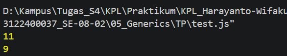

# 05_Generics
## Nama : Haryanto Wifakul Azmi  
## Kelas : SE 08 02  
## Nim : 103122400037  

### Soal

Buat satu fungsi untuk menghitung jumlah karakter pada string dengan dua mode:

- `semua` untuk menghitung semua karakter
- `huruf` untuk menghitung semua karakter selain spasi

Pada soal Modul 5 dijelaskan bahwa kode awal memakai dua perulangan terpisah untuk menghitung jumlah semua karakter dan jumlah huruf, lalu diminta menggabungkannya menjadi satu fungsi. Kode tes yang diberikan menggunakan string `"Bar bar bar"` dengan hasil yang diharapkan `11` untuk `"semua"` dan `9` untuk `"huruf"`. :contentReference[oaicite:1]{index=1}

### Kode sumber

- Module: :[index.js](Index.js)
- Testing: :[test.js](test.js)

### Output

### Deskripsi

Pada praktikum ini kita diminta untuk menggabungkan dua proses perhitungan (jumlah semua karakter dan jumlah huruf) menjadi satu fungsi.

Fungsi yang dibuat:

function hitung(str, tipe) {
    let kondisi;

    if (tipe === "huruf") {
        kondisi = (c) => c !== ' ';
    } else {
        kondisi = () => true;
    }

    let jumlah = 0;

    for (const c of str) {
        if (kondisi(c)) {
            jumlah++;
        }
    }

    return jumlah;
}

Fungsi ini bekerja dengan:
- Mengecek parameter tipe
- Jika "huruf" → spasi tidak dihitung
- Jika "semua" → semua karakter dihitung
- Menggunakan for...of untuk membaca tiap karakter
