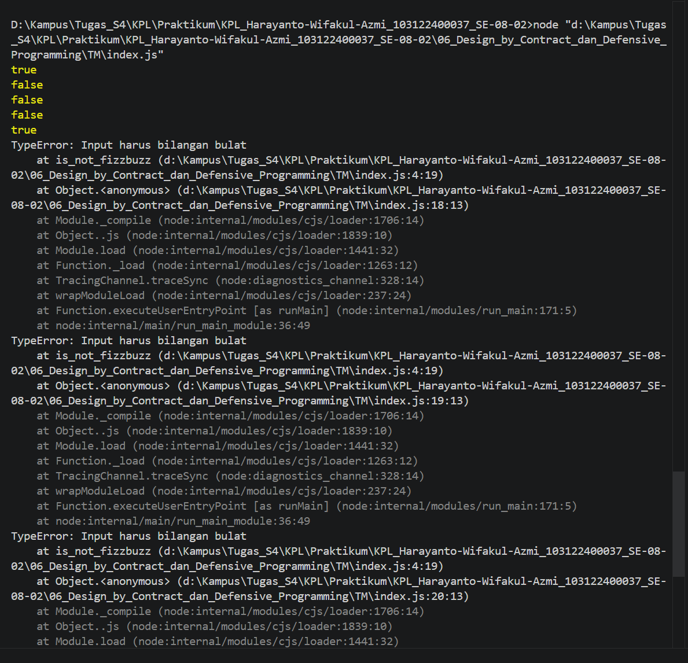

# 06_Design_by_Contract_dan_Defensive_Programming

## Nama : Haryanto Wifakul Azmi

## Kelas : SE-08-02

## Nim : 103122400037

---

## Soal

Lindungi kode dari bilangan-bilangan **FizzBuzz** dengan aturan berikut:

* Fungsi hanya menerima **bilangan bulat (integer)**
* Fungsi harus:

  * Mengembalikan **true** jika bukan kelipatan 3 atau 5
  * Mengembalikan **false** jika kelipatan 3, 5, atau 15
* Fungsi harus menerapkan **defensive programming**
* Jika input bukan bilangan bulat, maka harus **melempar TypeError**

---

## Kode Sumber

* Module: [`index.js`](index.js)

---

## Output



---

## Deskripsi

Pada praktikum ini kita diminta untuk menerapkan konsep **Design by Contract** dan **Defensive Programming** dalam sebuah fungsi sederhana.

### 1. Validasi Input (Precondition)

Fungsi `is_not_fizzbuzz` memiliki kontrak bahwa:

* Input harus berupa **bilangan bulat**

Validasi dilakukan menggunakan:

```js
Number.isInteger(number)
```

Jika kontrak dilanggar, maka fungsi akan:

```js
throw new TypeError('Input harus bilangan bulat');
```

---

### 2. Logika FizzBuzz

Setelah input valid, fungsi akan:

* Mengembalikan **false** jika angka:

  * Kelipatan 3 (Fizz)
  * Kelipatan 5 (Buzz)
  * Kelipatan 15 (FizzBuzz)
* Mengembalikan **true** jika bukan kelipatan keduanya

---

### 3. Defensive Programming

Fungsi ini mencegah input tidak valid seperti:

* `null`
* `NaN`
* `Infinity`
* bilangan desimal (contoh: `3.5`)

Dengan cara:

* Validasi di awal fungsi
* Menghentikan eksekusi jika input tidak sesuai

---

## Implementasi

```js
function is_not_fizzbuzz(number) {
    try {
        if (!Number.isInteger(number)) {
            throw new TypeError('Input harus bilangan bulat');
        }

        return number % 3 !== 0 && number % 5 !== 0;
    } catch (e) {
        return e;
    }
}
```

---

## Pengujian

```js
console.log(is_not_fizzbuzz(1)) // true
console.log(is_not_fizzbuzz(3)) // false
console.log(is_not_fizzbuzz(5)) // false
console.log(is_not_fizzbuzz(30)) // false
console.log(is_not_fizzbuzz(7)) // true
console.log(is_not_fizzbuzz(null)) // TypeError
console.log(is_not_fizzbuzz(NaN)) // TypeError
console.log(is_not_fizzbuzz(Infinity)) // TypeError
```

---

## Kesimpulan

* Fungsi menerapkan **Design by Contract** melalui validasi input (precondition)
* Fungsi menerapkan **Defensive Programming** untuk mencegah error runtime
* Error ditangani agar program tidak berhenti saat pengujian
* Logika sederhana dapat diperkuat dengan validasi yang baik
