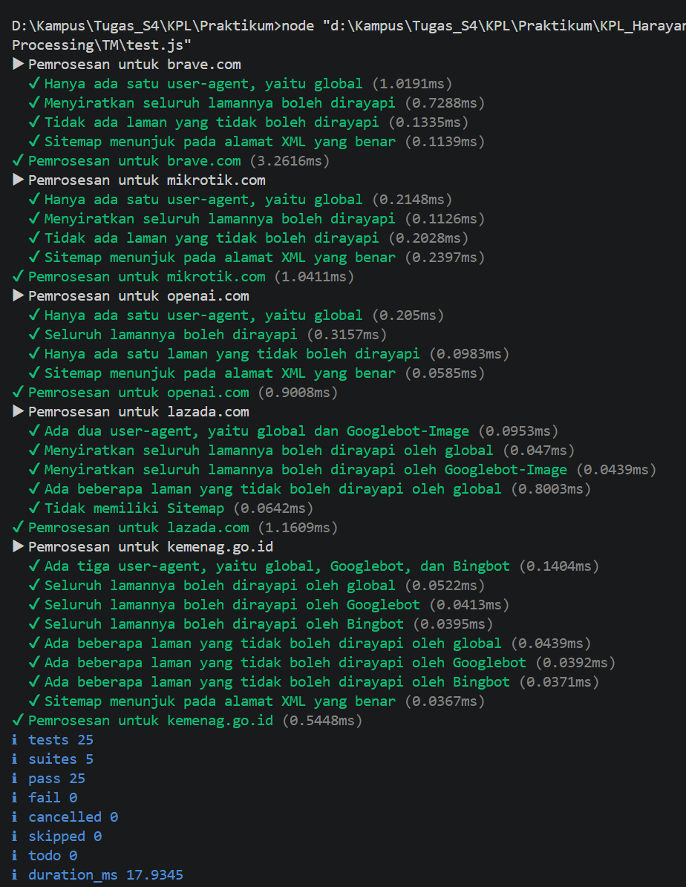

# 07_Grammar-based_Input_Processing

## Nama : Haryanto Wifakul Azmi

## Kelas : SE-08-02

## Nim : 103122400037

---

## Soal

Buat fungsi `parseRobots` dengan aturan berikut:

* Menerima input berupa teks isi berkas `robots.txt`
* Menguraikan isi `robots.txt` menjadi object JavaScript
* Mendukung properti:

  * `User-agent`
  * `Allow`
  * `Disallow`
  * `Sitemap`
* Mendukung lebih dari satu `User-agent`
* Mengelompokkan aturan `Allow` dan `Disallow` berdasarkan `User-agent`
* Menerapkan **state management** saat membaca isi file baris per baris

---

## Kode Sumber

* Module: [`index.js`](index.js)

---

## Output



---

## Deskripsi

Pada praktikum ini kita membuat fungsi untuk mengubah isi file **robots.txt** menjadi object JavaScript terstruktur.

Fungsi ini membaca isi file baris per baris, lalu mengenali directive penting seperti `User-agent`, `Allow`, `Disallow`, dan `Sitemap`.

Karena sebuah file `robots.txt` bisa memiliki lebih dari satu kelompok aturan, maka digunakan konsep **state management** agar setiap aturan dimasukkan ke `User-agent` yang sedang aktif.

---

### 1. Struktur Hasil Parsing

Hasil parsing disimpan dalam object dengan bentuk:

* `agents` → object berisi daftar user-agent
* `Sitemap` → array berisi daftar URL sitemap

Setiap user-agent memiliki:

* `Allow` → array halaman yang boleh dirayapi
* `Disallow` → array halaman yang tidak boleh dirayapi

Contoh bentuk hasil:

```js
{
  agents: {
    '*': {
      Allow: ['/'],
      Disallow: ['/admin/']
    }
  },
  Sitemap: ['https://example.com/sitemap.xml']
}

```
### 2. Pembacaan Baris

Isi teks dipecah menjadi beberapa baris menggunakan:

split(/\r?\n/)

Setelah itu setiap baris:

Dibersihkan dari komentar dengan split('#')[0]
Dihapus spasi awal dan akhir dengan trim()
Dilewati jika kosong

Dengan cara ini, parser hanya memproses baris yang benar-benar berisi aturan

### 3. State Management

Fungsi menggunakan variabel currentAgents untuk menyimpan User-agent yang sedang aktif.

Ketika menemukan baris seperti:

User-agent: Googlebot

maka parser:

Menyimpan nama agent ke lowercase
Membuat struktur agent jika belum ada
Mengubah state currentAgents ke agent tersebut

Lalu saat menemukan:

Allow: /
Disallow: /admin/

maka aturan itu dimasukkan ke agent yang sedang aktif.