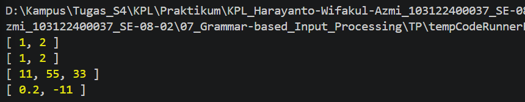

# 07_Grammar-based_Input_Processing

## Nama : Haryanto Wifakul Azmi

## Kelas : SE-08-02

## Nim : 103122400037

---

## Soal

Buat fungsi `toNumberArray` dengan aturan berikut:

* Menerima input berupa:

  * String berisi angka yang dipisahkan koma
  * Array yang berisi angka atau string angka
* Mengembalikan array berisi **number**
* Mengabaikan nilai yang tidak bisa dikonversi menjadi angka
* Menerapkan **defensive programming** untuk menangani berbagai jenis input

---

## Kode Sumber

* Module: [`index.js`](index.js)

---

## Output



---

## Deskripsi

Pada praktikum ini kita membuat fungsi untuk mengubah berbagai bentuk input menjadi array angka (**number array**).

Fungsi ini juga menerapkan konsep **Defensive Programming** dengan menangani berbagai tipe input yang mungkin diberikan.

---

### 1. Input Berupa String

Jika input berupa string:

* Dipisahkan berdasarkan tanda koma `,`
* Setiap elemen di-trim untuk menghapus spasi
* Dikonversi ke number menggunakan `Number()`
* Nilai yang tidak valid (NaN) akan dihapus

---

### 2. Input Berupa Array

Jika input berupa array:

* Setiap elemen dikonversi ke number
* Nilai yang tidak valid akan dihapus

---

### 3. Input Tidak Valid

Jika input bukan string atau array:

* Fungsi akan mengembalikan array kosong `[]`

---

### 4. Defensive Programming

Fungsi ini:

* Menghindari error dengan validasi tipe input
* Menggunakan `.filter()` untuk membuang nilai `NaN`
* Tidak melempar error, tetapi menangani input secara aman

---

## Implementasi

```js
function toNumberArray(number) {
    if (typeof number === "string") {
        return number
        .split(",")
        .map(item => item.trim())
        .map(item => Number(item))
        .filter(item => !isNaN(item));
    }

    if (Array.isArray(number)) {
        return number
        .map(item => Number(item))
        .filter(item => !isNaN(item));
    }

    return [];
}
```

---

## Pengujian

```js
console.log(toNumberArray("1, 2")) // [1, 2]
console.log(toNumberArray(["1", "2"])) // [1, 2]
console.log(toNumberArray(" 11,55,33   ")) // [11, 55, 33]
console.log(toNumberArray(["0.2", "-11", "abc23"])) // [0.2, -11]
```

---

## Kesimpulan

* Fungsi mampu menangani input string dan array
* Nilai tidak valid otomatis diabaikan
* Menggunakan pendekatan **defensive programming**
* Menghindari error runtime dengan validasi dan filtering
* Kode menjadi lebih aman dan fleksibel terhadap berbagai input

---
