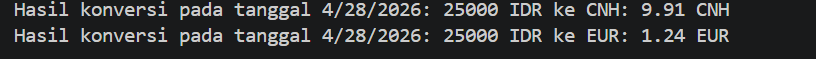
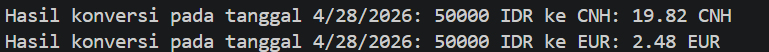
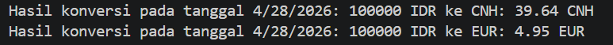

# 08_Tugas_Mandiri_Kurs_Mata_Uang

## Nama : Haryanto Wifakul Azmi  
## Kelas : SE-08-02  
## Nim : 103122400037  

---

## Soal

Buat program untuk menampilkan kurs rupiah (IDR) ke:

* Renminbi (CNH)
* Euro (EUR)

Dengan ketentuan:

* Gunakan API (simpan di `.env` sebagai `BASE_API`)
* Gunakan `Intl` untuk format angka & tanggal
* Hilangkan pesan promosi `dotenv`

---

## Kode Sumber

* Module: [`index.js`](index.js)

---

## Output
25.000

50.000

100.000

---

## Deskripsi

Program ini mengkonversi Rupiah ke CNH dan EUR menggunakan API dan menampilkan hasil dengan format lokal menggunakan **Intl (i18n)**.

---

### 1. Environment

* Gunakan `.env` untuk `BASE_API`
* `dotenv` dengan `{ quiet: true }`

---

### 2. Input

* Ambil dari `process.argv[2]`
* Contoh: node index.js 25000

---

### 3. API

* Fetch dari `BASE_API`
* Ambil:
* `data.idr.cnh`
* `data.idr.eur`

---

### 4. Perhitungan

* CNH = rupiah × kurs CNH  
* EUR = rupiah × kurs EUR  
