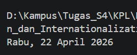

# 08_Runtime_Configuration_dan_Internationalization

## Nama : Haryanto Wifakul Azmi

## Kelas : SE-08-02

## Nim : 103122400037

---

## Soal

Tampilkan tanggal saat ini dengan format:

* "Sabtu, 18 April 2026"
* Menggunakan `Intl.DateTimeFormat`
* Tidak menggunakan string manual

---

## Kode Sumber

* Module: [`index.js`](index.js)

---

## Output

---

## Deskripsi

Pada praktikum ini kita mempelajari bagaimana menampilkan tanggal dengan format lokal menggunakan fitur **Internationalization (i18n)** pada JavaScript.

Kita menggunakan objek bawaan JavaScript yaitu **`Intl.DateTimeFormat`** untuk menghasilkan format tanggal sesuai dengan locale Indonesia (`id-ID`).

---

### 1. Membuat Objek Date

Tanggal saat ini diambil menggunakan:

* `new Date()`
* Menghasilkan objek waktu sekarang

---

### 2. Menggunakan Intl.DateTimeFormat

Untuk memformat tanggal:

* Locale yang digunakan adalah `'id-ID'`
* Properti yang digunakan:
  * `weekday: 'long'` → nama hari
  * `day: 'numeric'` → tanggal
  * `month: 'long'` → nama bulan
  * `year: 'numeric'` → tahun

---

### 3. Formatting Output

Tanggal diformat menggunakan:

* `.format(date)`
* Menghasilkan string sesuai format Indonesia

---

### 4. Internationalization (i18n)

Konsep i18n memungkinkan aplikasi:

* Mendukung berbagai bahasa
* Menyesuaikan format tanggal, angka, dan mata uang
* Menghindari penulisan format manual
