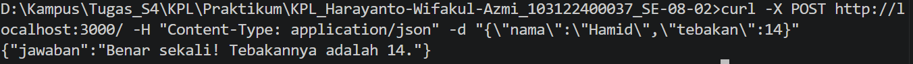
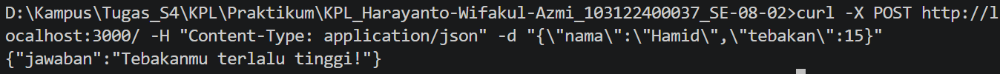
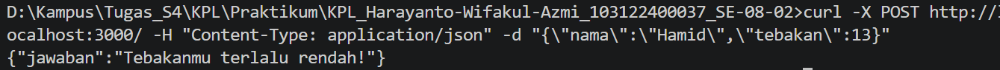

# 9.4 API_ Design_dan_ Construction_ Using_Swagger

## Nama : Haryanto Wifakul Azmi  
## Kelas : SE-08-02  
## Nim : 103122400037  

---

## Soal


---

## Kode Sumber

* Module: [`server.js`](server.js)

---

## Output


Contoh response jika tebakan benar:



Contoh response jika tebakan terlalu tinggi:



Contoh response jika tebakan terlalu rendah:



---

## Deskripsi

Program ini membuat API sederhana menggunakan modul bawaan **HTTP** dari Node.js. API hanya memiliki satu endpoint, yaitu `POST /`, yang digunakan untuk permainan tebak angka acak berdasarkan nama pengguna.

Angka yang dihasilkan bersifat tetap untuk nama yang sama karena dihitung dari nilai karakter pada nama. Nama bersifat sensitif terhadap huruf besar dan kecil, sehingga `Hamid` dan `hamid` menghasilkan angka yang berbeda.

---

### 1. Library yang Digunakan

Program ini tidak menggunakan library tambahan atau pustaka eksternal.

```js
const http = require("http");
```

Module `http` digunakan untuk membuat server API secara langsung menggunakan Node.js.

---

### 2. Fungsi Generate Angka

Fungsi `generateAngka` digunakan untuk menghasilkan angka tetap berdasarkan input `nama`.

```js
function generateAngka(nama) {
    let total = 0;

    for (let i = 0; i < nama.length; i++) {
        total += nama.charCodeAt(i) * (i + 1);
    }

    return (total % 100) + 1;
}
```

Penjelasan cara kerja fungsi:

* Setiap karakter pada nama diubah menjadi kode ASCII menggunakan `charCodeAt()`.
* Nilai karakter dikalikan dengan posisi indeks karakter.
* Semua nilai dijumlahkan ke dalam variabel `total`.
* Hasil akhir dibuat berada pada rentang 1 sampai 100 menggunakan rumus `(total % 100) + 1`.

---

### 3. Endpoint API

Endpoint yang dibuat:

```http
POST /
```

Endpoint ini menerima data JSON berupa `nama` dan `tebakan`.

```json
{
  "nama": "Hamid",
  "tebakan": 24
}
```

Jika method bukan `POST` atau URL bukan `/`, maka server akan mengembalikan response `404`.

```js
if (req.method !== "POST" || req.url !== "/") {
    res.writeHead(404, {
        "Content-Type": "application/json"
    });

    return res.end(JSON.stringify({
        jawaban: "Endpoint tidak ditemukan!"
    }));
}
```

---

### 4. Proses Membaca Request Body

Request body dibaca secara bertahap melalui event `data`, kemudian diproses setelah event `end`.

```js
let body = "";

req.on("data", chunk => {
    body += chunk;
});

req.on("end", () => {
    try {
        const data = JSON.parse(body);

        const nama = data.nama;
        const tebakan = data.tebakan;

        const angkaBenar = generateAngka(nama);
```

Data JSON kemudian diubah menjadi object menggunakan `JSON.parse()`.

---

### 5. Logika Tebakan

Setelah angka benar dihasilkan, program membandingkan nilai `tebakan` dengan `angkaBenar`.

```js
let jawaban;

if (tebakan === angkaBenar) {
    jawaban = `Benar sekali! Tebakannya adalah ${angkaBenar}.`;
} else if (tebakan > angkaBenar) {
    jawaban = "Tebakanmu terlalu tinggi!";
} else {
    jawaban = "Tebakanmu terlalu rendah!";
}
```

Terdapat tiga kemungkinan hasil:

* Jika tebakan sama dengan angka benar, maka response menyatakan tebakan benar.
* Jika tebakan lebih besar dari angka benar, maka response menyatakan tebakan terlalu tinggi.
* Jika tebakan lebih kecil dari angka benar, maka response menyatakan tebakan terlalu rendah.

---

### 6. Hasil Response

Jika request berhasil diproses, server akan mengembalikan response dengan status `200` dan format JSON.

```js
res.writeHead(200, {
    "Content-Type": "application/json"
});

res.end(JSON.stringify({
    jawaban: jawaban
}));
```

Contoh response:

```json
{
  "jawaban": "Tebakanmu terlalu tinggi!"
}
```

Jika format JSON tidak valid, server akan mengembalikan response dengan status `400`.

```js
res.writeHead(400, {
    "Content-Type": "application/json"
});

res.end(JSON.stringify({
    jawaban: "Format JSON tidak valid!"
}));
```

---

### 7. Menjalankan Server

Server berjalan pada port `3000`.

```js
server.listen(PORT, () => {
  console.log(`Server jalan di http://localhost:${PORT}`);
});
```

Untuk menjalankan program, gunakan perintah:

```bash
node server.js
```

Kemudian API dapat diakses pada alamat:

```http
http://localhost:3000/
```

---

## Kesimpulan

Endpoint `POST /` berhasil dibuat menggunakan Node.js tanpa library tambahan. API ini menerima input berupa nama dan tebakan, lalu menghasilkan angka tetap dalam rentang 1 sampai 100 berdasarkan nama. Program kemudian memberikan response apakah tebakan pengguna benar, terlalu tinggi, atau terlalu rendah.
