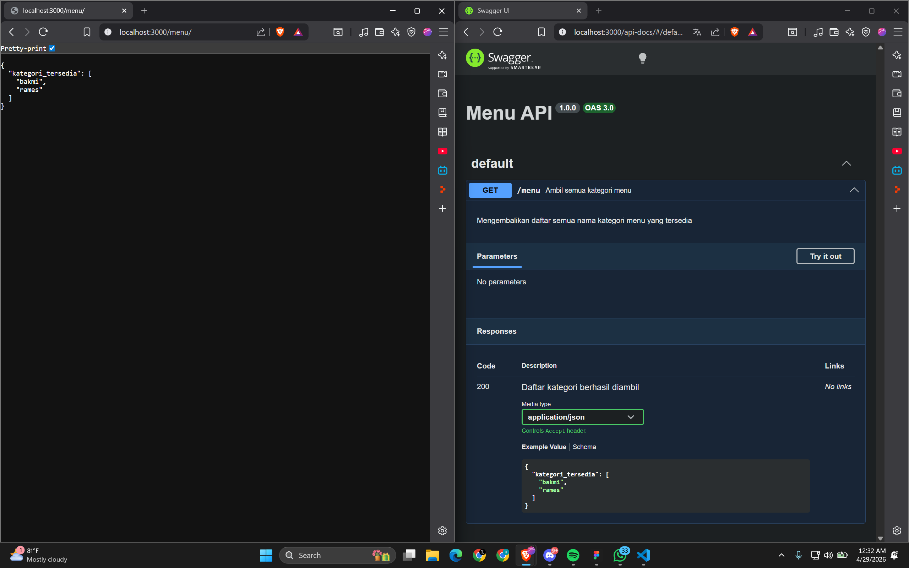

# API Design dan Construction Using Swagger

## Nama : Haryanto Wifakul Azmi  
## Kelas : SE-08-02  
## Nim : 103122400037  

---

## Soal

Buatlah satu *endpoint* lagi beserta dokumentasi OpenAPI-nya, yaitu `GET /menu` yang menampilkan daftar semua nama kategori menu yang ada.

Dengan ketentuan:

* Gunakan **Express.js** untuk membuat API
* Gunakan **Swagger UI** sebagai dokumentasi API
* Tambahkan dokumentasi **OpenAPI** untuk endpoint `GET /menu`
* Endpoint `GET /menu` menampilkan kategori menu yang tersedia

---

## Kode Sumber

* Module: [`index.js`](index.js)

---

## Output




---

## Deskripsi

Program ini membuat API sederhana menggunakan **Express.js** dan mendokumentasikan endpoint menggunakan **Swagger/OpenAPI**. Endpoint yang dibuat adalah `GET /menu`, yang berfungsi untuk mengambil daftar kategori menu yang tersedia dari data menu.

---

### 1. Library yang Digunakan

* `express` untuk membuat server API
* `swagger-ui-express` untuk menampilkan dokumentasi Swagger UI
* `swagger-jsdoc` untuk membuat spesifikasi OpenAPI dari komentar dokumentasi

---

### 2. Data Menu

Data menu disimpan dalam bentuk array object:

```js
const menus = [
  { id: 1, nama: "Bakmi Goreng", kategori: "bakmi" },
  { id: 2, nama: "Bakmi Kuah",   kategori: "bakmi" },
  { id: 3, nama: "Rames Ayam",   kategori: "rames" },
  { id: 4, nama: "Rames Telur",  kategori: "rames" },
];
```

---

### 3. Endpoint API

Endpoint yang dibuat:

```http
GET /menu
```

Endpoint ini mengambil semua kategori dari data menu, lalu menghapus kategori yang duplikat menggunakan `Set`.

```js
app.get('/menu', (req, res) => {
  const kategori_tersedia = [...new Set(menus.map(m => m.kategori))];
  res.json({ kategori_tersedia });
});
```

---

### 4. Dokumentasi OpenAPI

Dokumentasi OpenAPI untuk endpoint `GET /menu`:

```js
/**
 * @swagger
 * /menu:
 *   get:
 *     summary: Ambil semua kategori menu
 *     description: Menampilkan daftar semua nama kategori menu yang tersedia.
 *     responses:
 *       200:
 *         description: Daftar kategori berhasil diambil
 *         content:
 *           application/json:
 *             schema:
 *               type: object
 *               properties:
 *                 kategori_tersedia:
 *                   type: array
 *                   items:
 *                     type: string
 *                   example: ["bakmi", "rames"]
 */
```

---

### 5. Hasil Response

Contoh hasil response dari endpoint `GET /menu`:

```json
{
  "kategori_tersedia": [
    "bakmi",
    "rames"
  ]
}
```

---

## Kesimpulan

Endpoint `GET /menu` berhasil dibuat dan didokumentasikan menggunakan Swagger/OpenAPI. Endpoint ini menampilkan daftar kategori menu yang tersedia, yaitu `bakmi` dan `rames`.