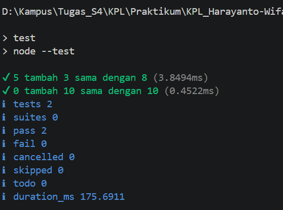

# 12_TM_Performance_Analysis_Unit_Testing_dan_Debugging

## Nama : Haryanto Wifakul Azmi  
## Kelas : SE-08-02  
## Nim : 103122400037  

---

## Soal

Diberikan sebuah fungsi JavaScript bernama `tambahPengitung` yang digunakan untuk menambahkan dua nilai. Kemudian buatlah unit testing untuk memastikan fungsi tersebut berjalan dengan benar.

Tugas:

1. Buat fungsi `tambahPengitung`.
2. Buat pengujian menggunakan `node:test`.
3. Pastikan hasil pengujian sesuai dengan output yang diharapkan.

---

## Kode Sumber

* Module: [`hitung.js`](hitung.js)
* Testing: [`hitung.test.js`](hitung.test.js)
* Konfigurasi package: [`package.json`](package.json)

---

## Deskripsi

Program ini dibuat untuk menerapkan konsep **Unit Testing** pada JavaScript menggunakan fitur bawaan Node.js, yaitu `node:test` dan `node:assert`.

Program memiliki satu fungsi utama bernama `tambahPengitung`. Fungsi ini menerima dua parameter, yaitu `terkini` dan `jumlah`, kemudian mengembalikan hasil penjumlahan dari kedua nilai tersebut.

Unit testing digunakan untuk memastikan bahwa fungsi `tambahPengitung` menghasilkan nilai yang benar pada beberapa skenario pengujian.

---

### 1. Konfigurasi Package

File `package.json` berisi konfigurasi project JavaScript yang digunakan untuk menjalankan unit testing.

```json
{
  "type": "module",
  "scripts": {
    "test": "node --test"
  }
}
```

Bagian penting dari konfigurasi ini adalah:

* `name` berisi nama project tugas mandiri
* `type: "module"` digunakan agar file JavaScript dapat menggunakan sintaks `export` dan `import`
* `main` mengarah ke file utama, yaitu `hitung.js`
* `scripts` berisi perintah `test` untuk menjalankan unit testing menggunakan `npm test`

---

### 2. Fungsi `tambahPengitung`

Fungsi `tambahPengitung` digunakan untuk menjumlahkan dua nilai.

```js
export function tambahPengitung(terkini, jumlah) {
  return terkini + jumlah;
}
```

Penjelasan fungsi:

* Fungsi menerima dua parameter, yaitu `terkini` dan `jumlah`
* Parameter `terkini` berisi nilai awal
* Parameter `jumlah` berisi nilai yang akan ditambahkan
* Fungsi mengembalikan hasil penjumlahan dari `terkini + jumlah`
* Keyword `export` digunakan agar fungsi dapat diimpor dan diuji pada file lain

---

### 3. File Unit Testing

File `hitung.test.js` digunakan untuk menguji fungsi `tambahPengitung`.

```js
import { test } from 'node:test';
import assert from 'node:assert';
import { tambahPengitung } from './hitung.js';

test('5 tambah 3 sama dengan 8', () => {
  assert.strictEqual(tambahPengitung(5, 3), 8);
});

test('0 tambah 10 sama dengan 10', () => {
  assert.strictEqual(tambahPengitung(0, 10), 10);
});
```

Penjelasan testing:

* `test` dari `node:test` digunakan untuk membuat skenario pengujian
* `assert` dari `node:assert` digunakan untuk membandingkan hasil aktual dengan hasil yang diharapkan
* Fungsi `tambahPengitung` diimpor dari file `hitung.js`
* Pengujian pertama memastikan `5 + 3` menghasilkan `8`
* Pengujian kedua memastikan `0 + 10` menghasilkan `10`

---

### 4. Cara Menjalankan Program

Untuk menjalankan unit testing, gunakan perintah berikut:

```bash
npm test
```

Atau bisa juga menggunakan perintah langsung:

```bash
node --test
```

Jika struktur file sudah benar, Node.js akan membaca file `hitung.test.js` dan menjalankan seluruh pengujian yang ada di dalamnya.

---

### 5. Hasil Output

Ketika perintah `npm test` atau `node --test` dijalankan, hasil yang muncul adalah kurang lebih seperti berikut:



Penjelasan output:

* Terdapat 2 skenario pengujian
* Semua pengujian berhasil dijalankan
* Tidak ada pengujian yang gagal
* Fungsi `tambahPengitung` terbukti menghasilkan nilai yang sesuai

---

### 6. Analisis Kode

Pada kode awal, fungsi `tambahPengitung` sebenarnya sudah benar dari sisi logika karena hanya menjumlahkan dua nilai.

Namun, agar fungsi dapat digunakan pada file testing, fungsi tersebut harus diekspor menggunakan keyword `export`.

Tanpa `export`, file `hitung.test.js` tidak dapat mengimpor fungsi tersebut, sehingga pengujian akan gagal dijalankan.

Kode yang benar adalah:

```js
export function tambahPengitung(terkini, jumlah) {
  return terkini + jumlah;
}
```

Dengan penambahan `export`, fungsi dapat digunakan di file lain menggunakan sintaks:

```js
import { tambahPengitung } from './hitung.js';
```

---

## Kesimpulan

Tugas Mandiri Modul 12 berhasil menerapkan konsep unit testing pada JavaScript. Fungsi `tambahPengitung` dibuat untuk menjumlahkan dua nilai, kemudian diuji menggunakan `node:test` dan `node:assert`.

Hasil pengujian menunjukkan bahwa fungsi berjalan dengan benar karena seluruh test berhasil atau berstatus pass. Selain itu, penggunaan `export` pada file `hitung.js` dan `"type": "module"` pada `package.json` diperlukan agar proses import dan testing dapat berjalan dengan baik.