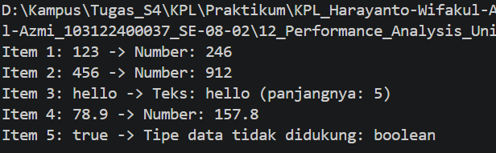

# 12_TP_Performance_Analysis_Unit_Testing_dan_Debugging

## Nama : Haryanto Wifakul Azmi  
## Kelas : SE-08-02  
## Nim : 103122400037  

---

## Soal

Diberikan sebuah program JavaScript yang memproses berbagai tipe data dalam sebuah array. Program tersebut mengalami error ketika dijalankan karena terdapat kecacatan pada proses pengolahan data.

Tugas:

1. Identifikasi kecacatan atau bug pada program.
2. Perbaiki kode agar program dapat berjalan dengan benar.
3. Jelaskan penyebab error dan solusi perbaikannya.

---

## Kode Sumber

* Program utama: [`index.js`](index.js)

---

## Deskripsi

Program ini dibuat untuk memproses data dari sebuah array yang berisi berbagai jenis nilai, seperti string, number, dan boolean. Setiap data akan diproses menggunakan fungsi `processData`, kemudian hasilnya ditampilkan ke terminal.

Pada kode awal, program mengalami error karena fungsi `toLowerCase()` langsung digunakan pada semua data tanpa mengecek tipe datanya terlebih dahulu. Padahal, fungsi `toLowerCase()` hanya dapat digunakan pada tipe data string.

Oleh karena itu, program diperbaiki dengan menambahkan pengecekan tipe data menggunakan `typeof`, sehingga setiap data dapat diproses sesuai dengan jenisnya.

---

### 1. Kode Awal yang Bermasalah

Kode awal program adalah sebagai berikut:

```js
function main() {
  const data = [
    "123",
    456,
    "hello",
    78.9,
    true,
  ];

  for (let i = 0; i < data.length; i++) {
    const result = processData(data[i]);
    console.log(`Item ${i + 1}: ${data[i]} -> ${result}`);
  }
}

function processData(data) {
  const str = data.toLowerCase();
  const num = parseInt(str);
  if (!isNaN(num) && str === String(num)) {
    return `Number: ${num * 2}`;
  }
  return `Teks: ${str} (panjangnya: ${str.length})`;
}

main();
```

Kecacatan terdapat pada bagian:

```js
const str = data.toLowerCase();
```

Baris tersebut menyebabkan error karena tidak semua data dalam array bertipe string. Data seperti `456`, `78.9`, dan `true` tidak memiliki method `toLowerCase()`.

---

### 2. Kode Setelah Diperbaiki

Berikut adalah kode program yang sudah diperbaiki:

```js
function main() {
  const data = [
    "123",
    456,
    "hello",
    78.9,
    true,
  ];

  for (let i = 0; i < data.length; i++) {
    const result = processData(data[i]);
    console.log(`Item ${i + 1}: ${data[i]} -> ${result}`);
  }
}

function processData(data) {
  if (typeof data === "number") {
    return `Number: ${data * 2}`;
  }

  if (typeof data === "string") {
    const str = data.toLowerCase();
    const num = Number(str);

    if (!isNaN(num) && str.trim() !== "") {
      return `Number: ${num * 2}`;
    }

    return `Teks: ${str} (panjangnya: ${str.length})`;
  }

  return `Tipe data tidak didukung: ${typeof data}`;
}

main();
```

---

### 3. Penjelasan Fungsi `main`

Fungsi `main` digunakan sebagai fungsi utama untuk menjalankan program.

```js
function main() {
  const data = [
    "123",
    456,
    "hello",
    78.9,
    true,
  ];

  for (let i = 0; i < data.length; i++) {
    const result = processData(data[i]);
    console.log(`Item ${i + 1}: ${data[i]} -> ${result}`);
  }
}
```

Penjelasan fungsi:

* Array `data` berisi beberapa tipe data, yaitu string, number, dan boolean
* Perulangan `for` digunakan untuk membaca setiap data satu per satu
* Setiap data dikirim ke fungsi `processData`
* Hasil pemrosesan ditampilkan menggunakan `console.log`

---

### 4. Penjelasan Fungsi `processData`

Fungsi `processData` digunakan untuk memproses data berdasarkan tipe datanya.

```js
function processData(data) {
  if (typeof data === "number") {
    return `Number: ${data * 2}`;
  }

  if (typeof data === "string") {
    const str = data.toLowerCase();
    const num = Number(str);

    if (!isNaN(num) && str.trim() !== "") {
      return `Number: ${num * 2}`;
    }

    return `Teks: ${str} (panjangnya: ${str.length})`;
  }

  return `Tipe data tidak didukung: ${typeof data}`;
}
```

Penjelasan fungsi:

* Jika data bertipe `number`, maka data langsung dikalikan dua
* Jika data bertipe `string`, maka data diubah menjadi huruf kecil menggunakan `toLowerCase()`
* Fungsi `Number()` digunakan untuk mengecek apakah string tersebut berisi angka
* Jika string berisi angka, maka angka tersebut dikalikan dua
* Jika string berisi teks biasa, maka program menampilkan teks dan panjang karakternya
* Jika data bukan string atau number, maka program menampilkan pesan bahwa tipe data tidak didukung

---

### 5. Hasil Output

Ketika program dijalankan, hasil output yang dihasilkan adalah:



Penjelasan output:

* Data `"123"` dikenali sebagai angka dalam bentuk string, sehingga hasilnya `246`
* Data `456` bertipe number, sehingga hasilnya `912`
* Data `"hello"` dikenali sebagai teks, sehingga ditampilkan panjang teksnya yaitu `5`
* Data `78.9` bertipe number, sehingga hasilnya `157.8`
* Data `true` bertipe boolean, sehingga tidak diproses sebagai angka atau teks

---

## Kesimpulan

Program pada Tugas Pendahuluan Modul 12 mengalami error karena method `toLowerCase()` digunakan pada data yang bukan bertipe string. Kesalahan ini diperbaiki dengan menambahkan pengecekan tipe data menggunakan `typeof`.

Setelah diperbaiki, program dapat memproses data bertipe string dan number dengan benar. Data bertipe boolean juga tidak menyebabkan error karena program sudah memberikan pesan bahwa tipe data tersebut tidak didukung. Dengan demikian, proses debugging berhasil dilakukan dan program dapat berjalan sesuai dengan tujuan.